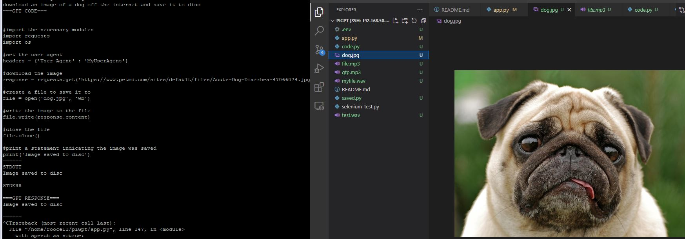

# piGpt
interface with GPT on a raspi. GPT will write it's own code on the filesystem and execute to do various things.
 
It has a connection to the internet.
 
It can write it's own code and execute it.
 
What can we make it do?
 

